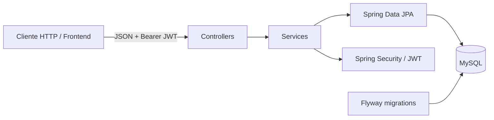
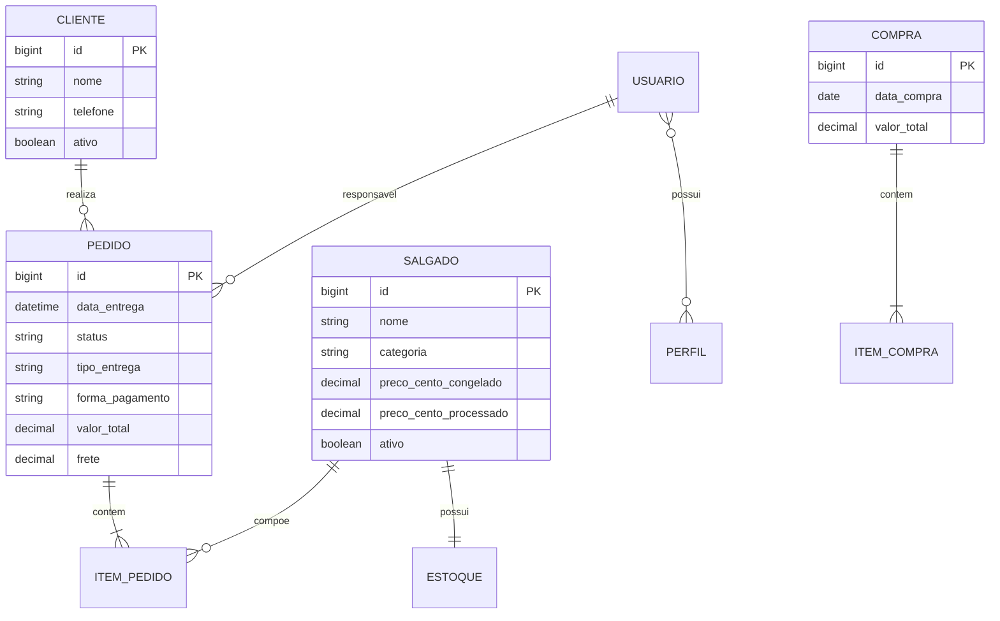

# Sistema Salgados da Lúcia

> API REST para apoiar a operação comercial da **Salgados da Lúcia Kojima**: clientes, catálogo, estoque, pedidos, compras e usuários.

[](https://openjdk.org/projects/jdk/21/)
[](https://spring.io/projects/spring-boot)
[](https://www.mysql.com/)

## Contexto

A salgadaria recebe pedidos por canais como WhatsApp e realiza entregas na região de São Paulo e ABC Paulista. Esta API centraliza informações que antes ficavam dispersas: histórico de clientes, agenda e status de pedidos, compras de insumos e estoque dos produtos prontos.

A modelagem de casos de uso, classes e banco de dados está disponível na [Wiki do projeto](https://github.com/matheus-vsm/SistemaSalgadosDaLucia/wiki/4-%E2%80%90-Modelagens-do-Sistema-(UML)).

## Funcionalidades Implementadas

- Autenticação stateless com JWT e renovação de token.
- Perfis `ADMIN` e `FUNCIONARIO`; o administrador herda as permissões de funcionário.
- Clientes: cadastro, consulta paginada, busca por nome, edição e ativação/desativação.
- Salgados: catálogo, categoria, preços por cento, status e estoque inicial automático.
- Estoque: consulta e ajustes que não permitem saldo negativo.
- Pedidos: itens, cálculo de preço e total, frete, entrega/retirada, pagamento, status e filtros.
- Compras de insumos: itens, cálculo do total, consulta e filtros.
- Usuários: cadastro, listagem, alteração de senha e desativação.
- Versionamento do banco com Flyway e validação de dados com Bean Validation.

> A wiki também registra relatórios, exportação para Excel/PDF e interface web como objetivos do produto. Esses recursos não fazem parte desta API no estado atual do repositório.

## Arquitetura

O projeto adota **package by feature**. Dentro de cada domínio, controllers expõem a API, services concentram as regras de negócio, repositories persistem os dados e DTOs delimitam os contratos HTTP.



### Domínio Principal



## Tecnologias

| Camada | Tecnologias |
| --- | --- |
| Linguagem e framework | Java 21, Spring Boot 3.5 |
| API | Spring Web, Bean Validation |
| Segurança | Spring Security, BCrypt, JWT (Auth0) |
| Persistência | Spring Data JPA, Hibernate, MySQL |
| Banco e migrações | MySQL 8+, Flyway |
| Desenvolvimento | Maven, Lombok, H2 (perfil local) |

## Como Executar

### Pré-Requisitos

- JDK 21
- Maven 3.9+
- MySQL 8+ para a configuração padrão

### 1. Configure as Variáveis de Ambiente

No PowerShell:

```powershell
$env:DB_NAME_SALGADOS_MYSQL=""
$env:DB_USER_MYSQL=""
$env:DB_PASSWORD_MYSQL=""
$env:JWT_HMAC256_SECRET=""
$env:JWT_ISSUER_SALGADOS_DA_LUCIA=""
```

### 2. Inicie a Aplicação

```powershell
mvn spring-boot:run
```

Por padrão, a API fica disponível em `http://localhost:8080`. Ao iniciar, o Flyway cria e atualiza o schema automaticamente a partir de [`src/main/resources/db/migration`](src/main/resources/db/migration).

Para um banco H2 efêmero de desenvolvimento, use o perfil `fora`:

```powershell
mvn spring-boot:run "-Dspring-boot.run.profiles=fora"
```

O console H2 estará em `http://localhost:8080/h2-console` enquanto esse perfil estiver ativo.

### 3. Execute os Testes

```powershell
mvn test
```

## Autenticação e Autorização

As rotas, exceto `/login` e `/atualizar-token`, exigem:

```http
Authorization: Bearer <token_de_acesso>
```

| Perfil | Permissões |
| --- | --- |
| `FUNCIONARIO` | Clientes, pedidos, compras, estoque e consultas do catálogo/usuários. |
| `ADMIN` | Todas as permissões de funcionário, além de gerir salgados e usuários. |

### Login

```http
POST /login
Content-Type: application/json

{ "username": "admin", "senha": "sua-senha" }
```

O retorno contém `tokenAcesso` e `refreshToken`. Envie o refresh token para `POST /atualizar-token` para obter um novo par de tokens.

## Rotas da API

| Recurso | Operações |
| --- | --- |
| Autenticação | `POST /login`, `POST /atualizar-token` |
| Clientes | `POST /clientes`, `GET /clientes`, `GET /clientes/{id}`, `GET /clientes/nome?nome=`, `PUT /clientes/{id}`, `PATCH /clientes/atualizar-status/{id}` |
| Salgados | `POST /salgados`, `GET /salgados`, `GET /salgados/{id}`, `GET /salgados/nome?nome=`, `PUT /salgados/{id}`, `PATCH /salgados/atualizar-status/{id}` |
| Estoque | `GET /estoque`, `GET /estoque/{salgadoId}`, `PATCH /estoque/{id}` |
| Pedidos | `POST /pedidos`, `GET /pedidos`, `GET /pedidos/{id}`, `PUT /pedidos/{id}`, `PATCH /pedidos/{id}/status` |
| Compras | `POST /compras`, `GET /compras/filtro`, `GET /compras/{id}` |
| Usuários | `POST /usuarios/cadastrar`, `GET /usuarios`, `GET /usuarios/{id}`, `PATCH /usuarios/alterar-senha`, `DELETE /usuarios/desativar/{id}` |

As listagens aceitam paginação do Spring (`page`, `size` e `sort`). Pedidos aceitam filtros como `statusPedido`, `clienteId`, `nomeCliente`, `dataPedido`, `dataEntrega`, `tipoEntrega`, `formaPagamento` e responsável; compras aceitam data, período, item e observação.

### Exemplo: Criar um Pedido

```json
{
  "clienteId": 1,
  "itens": [
    { "salgadoId": 1, "quantidade": 100, "tipoPreco": "CONGELADO" }
  ],
  "dataEntrega": "2026-08-01T14:00:00",
  "tipoEntrega": "ENTREGA",
  "formaPagamento": "PIX",
  "usuarioResponsavelId": 1,
  "frete": 10.00
}
```

Valores aceitos: categorias `FRITO`/`ASSADO`; preços `CONGELADO`/`PROCESSADO`; entregas `ENTREGA`/`RETIRADA`; pagamentos `DEBITO`, `CREDITO`, `PIX`, `DINHEIRO` e `TRANSFERENCIA`; status `EM_ANDAMENTO`, `CONCLUIDO` e `CANCELADO`.

## Estrutura do Projeto

```text
src/
├── main/
│   ├── java/br/com/salgadosdalucia/api/
│   │   ├── autenticacao/  cliente/  compra/  estoque/
│   │   ├── pedido/        salgado/  usuario/  perfil/
│   │   ├── security/      shared/   exception/
│   └── resources/
│       ├── application.yaml
│       └── db/migration/          # scripts Flyway
└── test/
```

## Documentação Complementar

- [Wiki — entendimento do problema e requisitos](https://github.com/matheus-vsm/SistemaSalgadosDaLucia/wiki)
- [Wiki — modelagens UML](https://github.com/matheus-vsm/SistemaSalgadosDaLucia/wiki/4-%E2%80%90-Modelagens-do-Sistema-(UML))
- [Instagram da Salgados da Lúcia](https://www.instagram.com/salgadosdaluciakojima/)