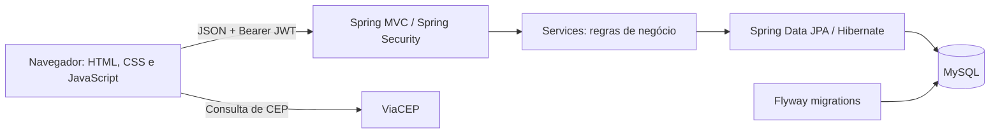
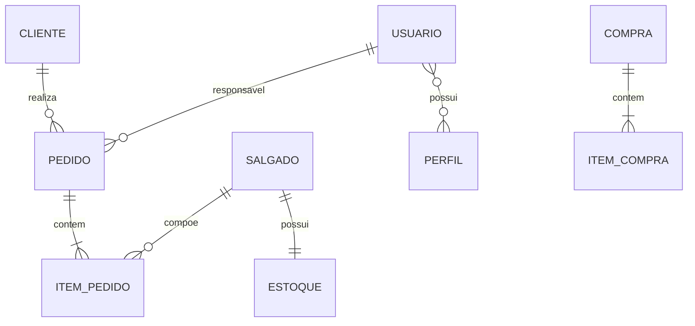

# Sistema Salgados da Lúcia

> Sistema de gestão comercial da **Salgados da Lúcia Kojima**, com interface web e API REST para clientes, catálogo,
> estoque, pedidos, compras e usuários.

[](https://openjdk.org/projects/jdk/21/)
[](https://spring.io/projects/spring-boot)
[](https://www.mysql.com/)


## Contexto

A salgadaria recebe pedidos por canais como WhatsApp e realiza entregas na região de São Paulo e ABC Paulista. O sistema
centraliza o cadastro de clientes, o catálogo, a agenda de entregas, o acompanhamento de pedidos, as compras de insumos
e o estoque de salgados.

O repositório reúne o **backend em Java/Spring Boot** e o **frontend em HTML, CSS e JavaScript puro**, integrado à API.
As telas operacionais já estão implementadas; a página inicial ainda é uma estrutura básica, sem indicadores ou
relatórios.

## Funcionalidades

### Interface web

| Tela               | Recursos implementados                                                                                                                                                                                                                                                                                    |
|--------------------|-----------------------------------------------------------------------------------------------------------------------------------------------------------------------------------------------------------------------------------------------------------------------------------------------------------|
| Login              | Autenticação por usuário e senha, armazenamento dos tokens e abertura do painel após o login.                                                                                                                                                                                                             |
| Clientes           | Cadastro com endereço, preenchimento por CEP via ViaCEP, listagem paginada, busca por nome, consulta de ativos/inativos, detalhes, edição e ativação/desativação por modal.                                                                                                                               |
| Salgados e estoque | Cadastro de nome, descrição, categoria e preços por cento para congelados/processados; busca por nome, paginação, ativos/inativos, detalhes, edição, alteração de status e ajuste de estoque.                                                                                                             |
| Pedidos            | Cadastro e edição, seleção de cliente e salgados, inclusão/remoção de itens, quantidades, tipo de preço, prévia de subtotais e total, frete, data/hora de entrega, entrega ou retirada e forma de pagamento. Histórico paginado, filtros por status e período de entrega, detalhes e alteração de status. |
| Compras            | Cadastro e edição de compras de insumos, inclusão/remoção de itens com quantidade e valor unitário, prévia do total, data e observação. Histórico paginado, filtro por período e detalhes em modal.                                                                                                       |
| Usuários           | Cadastro com perfil de acesso, listagem paginada, busca por nome, consulta de ativos/inativos, desativação e alteração da própria senha com confirmação.                                                                                                                                                  |

A navegação lateral carrega as telas sem recarregar a página inteira. Cards, formulários e modais têm templates
próprios; o modal compartilhado pode ser fechado pelo botão, pelo fundo ou pela tecla `Esc`. A interface utiliza
formatação monetária brasileira e estilos com ajustes para telas menores.

### API e regras de negócio

- Autenticação stateless com JWT e endpoint de renovação de tokens.
- Perfis `ADMIN` e `FUNCIONARIO`, com herança das permissões de funcionário pelo administrador.
- Senhas armazenadas com BCrypt e validação da senha atual na troca de senha.
- Cadastro de salgados com criação automática do respectivo estoque.
- Ajustes de estoque por variação positiva ou negativa, sem permitir saldo final negativo.
- Pedidos associados a clientes, salgados e responsáveis ativos; edição permitida apenas para pedidos `EM_ANDAMENTO`.
- Cálculo do preço unitário a partir do preço por cento, subtotais dos itens e total do pedido com frete.
- Compras com recálculo de subtotais e total no cadastro e na edição.
- Paginação e filtros, validação de dados, tratamento centralizado de exceções e DTOs para os contratos HTTP.
- Endpoints de enums para preencher categorias, perfis e opções dos pedidos no frontend.
- Migrações de banco com Flyway e documentação da API com Swagger/OpenAPI.

## Tecnologias

| Camada                  | Tecnologias                                                             |
|-------------------------|-------------------------------------------------------------------------|
| Frontend                | HTML5, CSS3, JavaScript puro, Fetch API, Local Storage                  |
| Consulta de CEP         | ViaCEP                                                                  |
| Backend                 | Java 21, Spring Boot 3.5.15, Spring Web, Bean Validation, Lombok        |
| Segurança               | Spring Security, BCrypt, JWT com Auth0 Java JWT                         |
| Persistência            | Spring Data JPA, Hibernate, MySQL, Flyway                               |
| Documentação da API     | Springdoc OpenAPI e Swagger UI                                          |
| Build e desenvolvimento | Maven Wrapper (Maven 3.9.12), Spring Boot DevTools, H2 no perfil `fora` |
| Dependências de teste   | Spring Boot Test e Spring Security Test                                 |

O frontend não exige framework, instalação de pacotes npm ou etapa de build. Ele deve ser servido por HTTP, pois carrega
os módulos e templates com `fetch`.

## Arquitetura

O backend segue **package by feature**: cada domínio agrupa controllers, services, repositories, entidades, mappers e
DTOs. O frontend também é organizado por funcionalidade, com arquivos HTML, CSS e JavaScript separados por módulo.



### Organização do frontend

- [`frontend/index.html`](frontend/index.html): tela de login, estrutura do painel, menu e modal compartilhado.
- [`frontend/app.js`](frontend/app.js): login e carregamento dinâmico de HTML, CSS e scripts dos módulos. O evento
  `pagina:carregada` inicia cada tela.
- [`frontend/js/api.js`](frontend/js/api.js): endereço base da API, envio de JSON e Bearer token, leitura de respostas e
  limpeza dos tokens em respostas `401`.
- [`frontend/js/modal.js`](frontend/js/modal.js): abertura e fechamento do modal reutilizável.
- [`frontend/js/viacep.js`](frontend/js/viacep.js): consulta de endereço por CEP.
- Pastas dos módulos: templates de páginas, cards, itens e modais, estilos específicos e lógica de integração com a API.

### Domínio principal



## Como executar

### Pré-requisitos

- JDK 21 e `JAVA_HOME` configurado.
- MySQL 8+ para o perfil padrão.
- Navegador e servidor HTTP estático para o frontend; o exemplo abaixo usa Python 3.
- Acesso à internet no primeiro uso do Maven Wrapper para baixar Maven e dependências, e para a consulta de CEP.

Os comandos abaixo usam PowerShell e partem da raiz do repositório, exceto quando indicado.

### 1. Configure o backend

Defina as variáveis no terminal em que o backend será iniciado, substituindo os valores de exemplo:

```powershell
$env:DB_NAME_SALGADOS_MYSQL="salgados_lucia"
$env:DB_USER_MYSQL="seu_usuario_mysql"
$env:DB_PASSWORD_MYSQL="sua_senha_mysql"
$env:JWT_HMAC256_SECRET="substitua-por-um-segredo-local"
$env:JWT_ISSUER_SALGADOS_DA_LUCIA="salgados-da-lucia-kojima"
```

A configuração padrão conecta ao MySQL em `localhost:3306`. O usuário do banco precisa das permissões necessárias para
criar o banco, caso ainda não exista, e aplicar as migrações.

**Limitação atual:** `JWT_HMAC256_SECRET` é exigida pela configuração, mas o `TokenService` ainda usa uma chave fixa no
algoritmo de assinatura. Alterar essa variável, sozinho, não altera a chave efetivamente usada pelo código atual.

### 2. Inicie a API

```powershell
cd backend
.\mvnw.cmd spring-boot:run
```

Se já houver Maven instalado, pode usar `mvn spring-boot:run` dentro de `backend`. Em Linux/macOS, o wrapper equivalente
é `./mvnw`.

A URL base completa é:

```text
http://localhost:8080/api/salgados-da-lucia-kojima
```

O Flyway aplica as migrações de [`backend/src/main/resources/db/migration`](backend/src/main/resources/db/migration) na
inicialização do perfil padrão.

### 3. Prepare o primeiro acesso

Não há usuário ou senha padrão nem criação automática de administrador no repositório. Em um banco novo, é necessário
provisionar um usuário ativo na tabela `usuarios`, com senha codificada em BCrypt, e associá-lo ao perfil `ADMIN` pela
tabela `usuarios_perfis`.

No MySQL, a migração `V14` já cadastra os perfis `ADMIN` e `FUNCIONARIO`. O cadastro de novos usuários pela API ou pela
interface exige um administrador autenticado, portanto não substitui esse provisionamento inicial.

### 4. Inicie o frontend

Em outro terminal, na raiz do repositório:

```powershell
python -m http.server 5500 --bind 127.0.0.1 --directory frontend
```

Abra [o painel local](http://127.0.0.1:5500) e entre com um usuário previamente cadastrado. Também é possível usar um
servidor estático como o Live Server, servindo a pasta `frontend`.

O endereço do backend está definido em `API_BASE_URL`, no arquivo [`frontend/js/api.js`](frontend/js/api.js). Se mudar o
host, a porta ou o contexto da API, atualize esse valor. Os controllers possuem `@CrossOrigin` e a configuração de
segurança habilita CORS para a comunicação entre frontend e backend.

Não abra `index.html` diretamente por `file://`: o carregamento dos templates depende de um servidor HTTP.

### Alternativa: banco H2 em memória

Dentro de `backend`, com as variáveis JWT definidas:

```powershell
.\mvnw.cmd spring-boot:run "-Dspring-boot.run.profiles=fora"
```

O perfil `fora` usa `jdbc:h2:mem:salgados_lucia;DB_CLOSE_DELAY=-1;MODE=MySQL`, usuário `sa` e senha vazia. O Hibernate
cria as tabelas e os dados são temporários; o Flyway fica desabilitado. Por isso, os perfis e o primeiro administrador
também precisam ser provisionados nesse ambiente.

O console H2 é habilitado em `/api/salgados-da-lucia-kojima/h2-console`, mas a configuração atual de segurança não
libera essa rota nem configura os frames do console. O perfil, por si só, não garante acesso ao console pelo navegador.

## Autenticação e permissões

As rotas abaixo são relativas à URL base da API. Os endpoints de `/autenticacao/**` e a documentação Swagger/OpenAPI são
públicos; os demais exigem autenticação.

```http
POST /api/salgados-da-lucia-kojima/autenticacao/login
Content-Type: application/json

{ "username": "seu_usuario", "senha": "sua_senha" }
```

A resposta contém `tokenAcesso` e `refreshToken`. Para chamadas protegidas:

```http
Authorization: Bearer <token_de_acesso>
```

A renovação está disponível por `POST /autenticacao/atualizar-token`, com o corpo:

```json
{
  "refreshToken": "seu_refresh_token"
}
```

| Perfil        | Permissões na API                                                                                                      |
|---------------|------------------------------------------------------------------------------------------------------------------------|
| `FUNCIONARIO` | Gerenciar clientes, pedidos, compras e ajustes de estoque; consultar salgados e usuários; alterar a própria senha.     |
| `ADMIN`       | Todas as permissões de funcionário, além de cadastrar/editar/ativar/desativar salgados e cadastrar/desativar usuários. |

A autorização é aplicada pelo backend. O menu do frontend é compartilhado entre os perfis e não oculta todas as ações
restritas ao administrador.

No navegador, os tokens ficam no `localStorage`. A renovação automática ainda não está integrada: ao receber `401`, o
cliente HTTP limpa os tokens e informa que é necessário entrar novamente. Também não há botão de logout nem restauração
automática do painel ao recarregar a página.

## Rotas da API

Prefixo de todas as rotas: `/api/salgados-da-lucia-kojima`.

| Recurso      | Operações                                                                                                                                                              |
|--------------|------------------------------------------------------------------------------------------------------------------------------------------------------------------------|
| Autenticação | `POST /autenticacao/login`, `POST /autenticacao/atualizar-token`                                                                                                       |
| Clientes     | `POST /clientes`, `GET /clientes`, `GET /clientes/{id}`, `GET /clientes/nome?nome=`, `PUT /clientes/{id}`, `PATCH /clientes/{id}`                                      |
| Salgados     | `POST /salgados`, `GET /salgados`, `GET /salgados/{id}`, `GET /salgados/nome?nome=`, `PUT /salgados/{id}`, `PATCH /salgados/{id}`                                      |
| Estoque      | `GET /estoque`, `GET /estoque/{salgadoId}`, `PATCH /estoque/{salgadoId}`                                                                                               |
| Pedidos      | `POST /pedidos`, `GET /pedidos`, `GET /pedidos/{id}`, `PUT /pedidos/{id}`, `PATCH /pedidos/{id}`                                                                       |
| Compras      | `POST /compras`, `GET /compras`, `GET /compras/{id}`, `PUT /compras/{id}`                                                                                              |
| Usuários     | `POST /usuarios/cadastrar`, `GET /usuarios`, `GET /usuarios/nome?nome=`, `GET /usuarios/{id}`, `PATCH /usuarios` (própria senha), `PATCH /usuarios/{id}` (desativação) |
| Enums        | `GET /enums/pedido`, `GET /enums/salgado`, `GET /enums/usuario`                                                                                                        |

### Paginação e filtros

As listagens paginadas aceitam `page`, `size` e `sort`, com páginas começando em zero. As listagens gerais de clientes,
salgados e usuários exigem `ativo=true` ou `ativo=false`.

- **Pedidos:** `statusPedido`, `clienteId`, `nomeCliente`, `dataPedido`, `dataInicioEntrega`, `dataFimEntrega`,
  `tipoEntrega`, `formaPagamento`, `usuarioResponsavelId` e `nomeUsuarioResponsavel`. Os limites do período de entrega
  usam `dd-MM-yyyy HH:mm:ss` na query string.
- **Compras:** `dataInicioCompra`, `dataFimCompra`, `nomeItem` e `observacao`. As datas dos filtros usam `dd-MM-yyyy`.
- Quando apenas o início de um período é informado, a API consulta aquele dia. As telas convertem as datas dos
  formulários para os formatos esperados.

### Exemplo: criar pedido

Envie para `POST /pedidos`, com IDs de registros ativos e uma data de entrega futura:

```json
{
  "clienteId": 1,
  "itens": [
    {
      "salgadoId": 1,
      "quantidade": 100,
      "tipoPreco": "CONGELADO"
    }
  ],
  "dataPedido": "2026-09-26",
  "dataEntrega": "2026-12-20T14:00:00",
  "tipoEntrega": "ENTREGA",
  "formaPagamento": "PIX",
  "usuarioResponsavelId": 1,
  "frete": 10.00
}
```

Ajuste as datas ao executar o exemplo. Valores aceitos: categorias `FRITO`/`ASSADO`; preços `CONGELADO`/`PROCESSADO`;
entregas `ENTREGA`/`RETIRADA`; pagamentos `DEBITO`, `CREDITO`, `PIX`, `DINHEIRO` e `TRANSFERENCIA`; status
`EM_ANDAMENTO`, `CONCLUIDO` e `CANCELADO`.

### Swagger / OpenAPI

Com o backend em execução:

- [Swagger UI](http://localhost:8080/api/salgados-da-lucia-kojima/swagger-ui/index.html)
- [Especificação OpenAPI](http://localhost:8080/api/salgados-da-lucia-kojima/v3/api-docs)

Use o token de acesso no botão **Authorize** para experimentar os endpoints protegidos.

## Estrutura do projeto

```text
SistemaSalgadosDaLucia/
├── backend/
│   ├── .mvn/wrapper/
│   ├── mvnw / mvnw.cmd
│   ├── pom.xml
│   └── src/
│       ├── main/
│       │   ├── java/br/com/salgadosdalucia/api/
│       │   │   ├── autenticacao/  cliente/  compra/  estoque/
│       │   │   ├── pedido/  salgado/  usuario/  perfil/  enums/
│       │   │   └── config/  security/  shared/  handler/  exception/
│       │   └── resources/
│       │       ├── application.yaml
│       │       ├── application-fora.yaml
│       │       └── db/migration/
│       └── test/
├── frontend/
│   ├── index.html
│   ├── app.js
│   ├── style.css
│   ├── js/                    # API, modais e ViaCEP
│   ├── imagens/
│   ├── inicio/html/
│   ├── cliente/               # html/, css/ e js/
│   ├── salgado/               # catálogo e estoque
│   ├── pedidos/
│   ├── compras/
│   └── usuarios/
└── README.md
```

## Testes e estado atual

Para executar a fase de testes do Maven, dentro de `backend`:

```powershell
.\mvnw.cmd test
```

Os arquivos `ClienteControllerTest` e `ClienteServiceTest` estão comentados no estado atual do repositório; esse comando
não representa uma suíte ativa de cobertura funcional. O frontend também não possui suíte automatizada configurada.

Além das telas operacionais implementadas, permanecem os seguintes pontos:

- A página **Início** ainda não apresenta dashboard, indicadores ou relatórios.
- Exportações para Excel/PDF ainda não estão implementadas.
- A seleção de imagem no cadastro/edição de salgados gera apenas uma prévia local; não há upload ou persistência da
  imagem na API.
- Pedidos e compras não movimentam automaticamente o estoque de salgados; os ajustes são realizados pelo módulo de
  estoque.
- O primeiro administrador precisa ser provisionado, e a sessão no frontend ainda requer as melhorias descritas na seção
  de autenticação.

## Documentação complementar

- [Wiki — entendimento do problema e requisitos](https://github.com/matheus-vsm/SistemaSalgadosDaLucia/wiki)
- [Wiki — modelagens UML](https://github.com/matheus-vsm/SistemaSalgadosDaLucia/wiki/4-%E2%80%90-Modelagens-do-Sistema-(UML))
- [Instagram da Salgados da Lúcia](https://www.instagram.com/salgadosdaluciakojima/)
